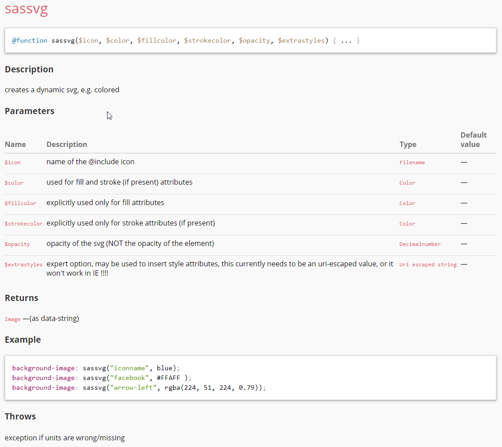
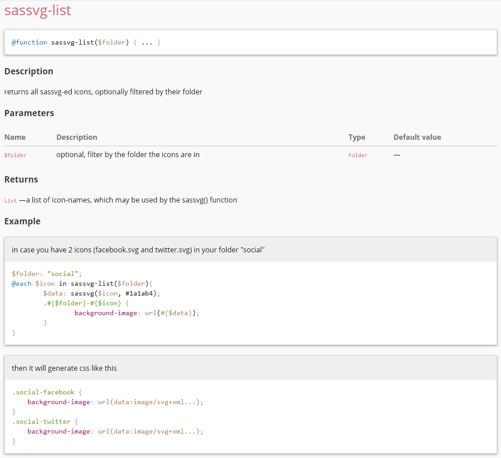
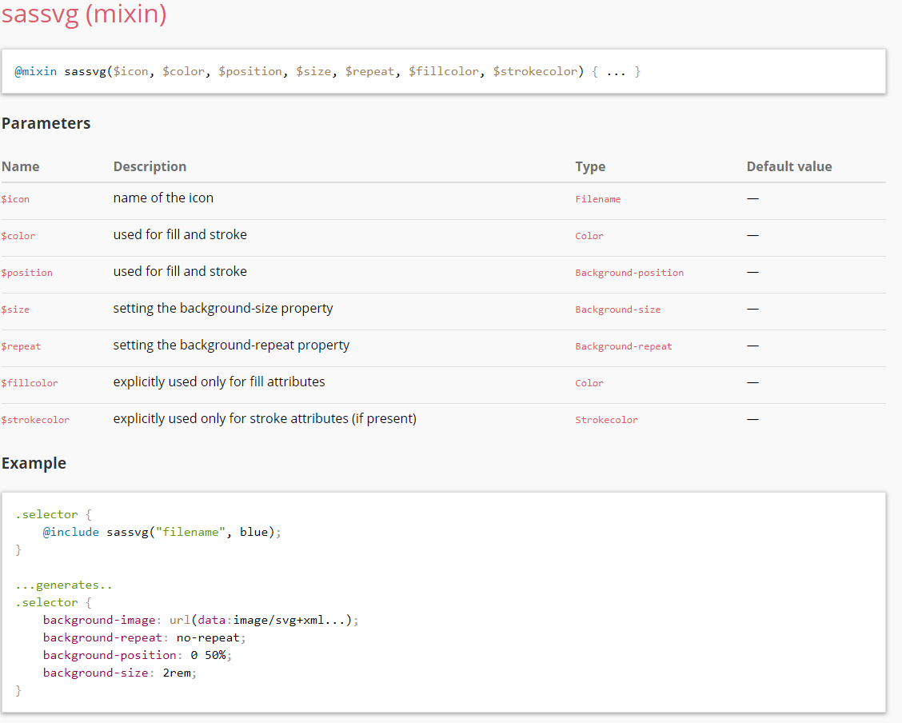

[](http://badge.fury.io/js/gulp-sassvg)

# gulp-sassvg


# How to use

## Install
```
npm install gulp-sassvg --save-dev
```

## In your gulpfile.js
```
var sassvg = require('gulp-sassvg');

gulp.task('sassvg', function(){
    return gulp.src('./path/to/images/folder/**/*.svg') 
        .pipe(sassvg({
          outputFolder: './sassvg/', // IMPORTANT: this folder needs to exist
			optimizeSvg: true // true (default) means about 25% reduction of generated file size, but 3x time for generating the _icons.scss file
        }));
});
```

## 
````scss
@import "_sassvg.scss;

.selector {
  background-image: sassvg('filename');
}
````
will generate
````css
.selector {
  background: url('data:image/svg+xml;utf8,<svg ...> ... </svg>');
}
````

````scss
@import "_sassvg.scss;

.selector {
  @sassvg('filename');
}
````
will generate
````css
.selector {
  background: url('data:image/svg+xml;utf8,<svg ...> ... </svg>');
  background-position: 50%;
  background-size: 2rem;
  
}
````

In svg files use no-sassvg class on elements where color, stroke or style should not be replaced:
````xml
<path stroke="#535A64" ... />
<path class="no-sassvg" stroke="#535A64" ... />
````
will generate
````xml
<path stroke="#{$strokecolor}" ... />
<path class="no-sassvg" stroke="#535A64" ... />
````


## Documentation
Documentation may be generated using sassdoc. Otherwise, just read the _sassvg.scss file, should be clear how to use the provided sassvg() and the sassvg-list() functions. Here are some screeenshots of the essential sassdoc parts:








# FAQ

**Browser support**
IT works in every browser supporting SVGs (basically IE9+ and Android 3+), detailled information may be found here: http://caniuse.com/#search=svg

**Performance?**
Sassvg is blazingly fast. It's approximately 0.1ms/icon with libsass. So even if you have 100 different icons, the you will see the result after about 0.08-0.12 seconds. 

**What about the File Size?**
Make sure you serve the CSS-File gzipped (which should be standard nowadays on every server). Then your transfered file-size will be even **lower** than if you would serve them "normally" by referencing the background-images via url. How?

We uri-encode the SVGs, instead of base64-encoding them. Therefore the gzip-compression may do its magic when dealing with similar files. E.g. if you have an SVG, which you SASSVG in 2 different colors, the generated CSS will look like:
````css
.selector {
	background-image: url('data:image/svg+xml;utf8,3Csvg%20fill%3D%22FIRSTCOLOR%22...');
}
.selector:hover {
	background-image: url('data:image/svg+xml;utf8,3Csvg%20fill%3D%22SECONDCOLOR%22...');
}
````
As the Strings will be VERY similar (except some color values), the gzip-compression may drastically reduce the file size, even much lower as if you would reference 2 external SVGS.


**Why does this plugin create so many sassvg-*iconname* functions?**
Due to performance reasons. I've tested all possibilities to create dynamic SVGs with SASS (one huge map in a mixin, assembling the SVG from single strings, str_replace the dynamic parts) and this solution scales (by far) best! Adding some hundred icons is no problem :-)


**Does sassvg work with libSass**
LibSass is even encouraged for best performance, but it works with RubySass or DartSass as well.
